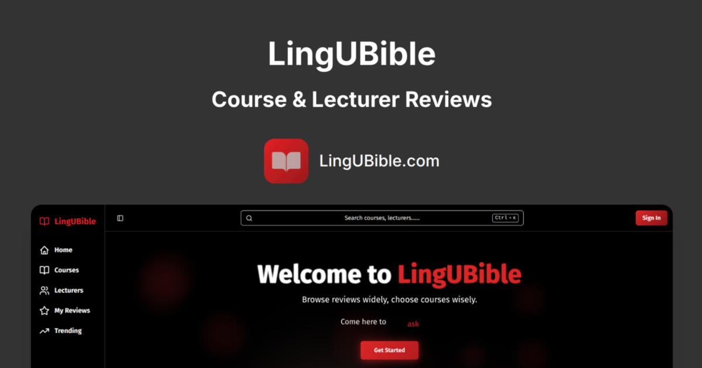
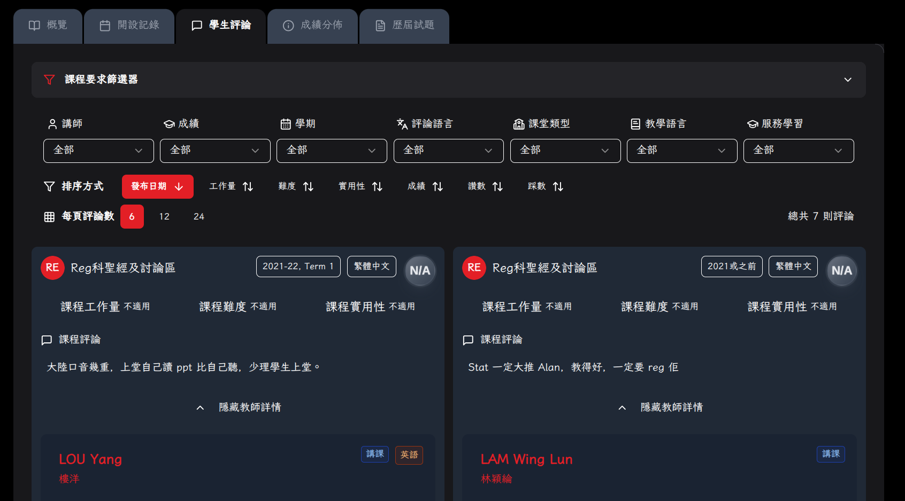
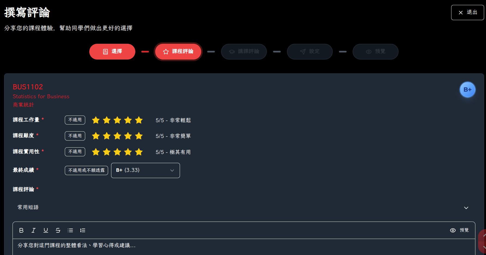
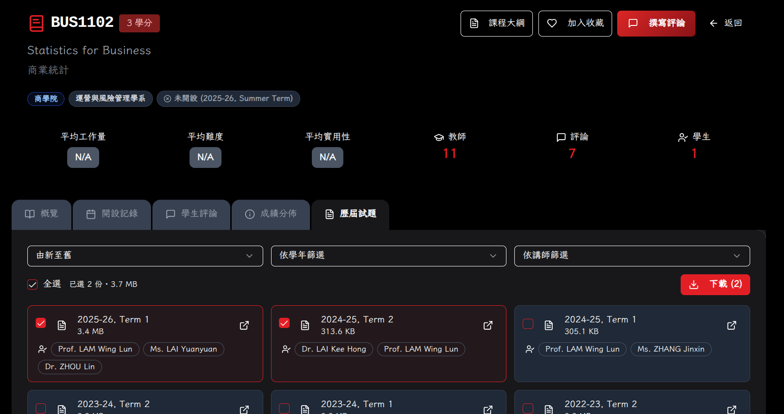
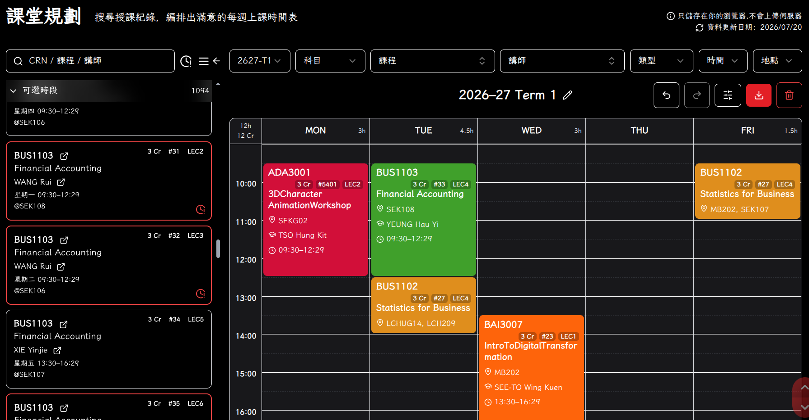
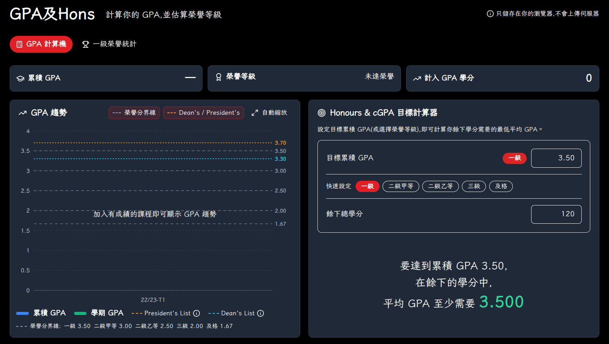
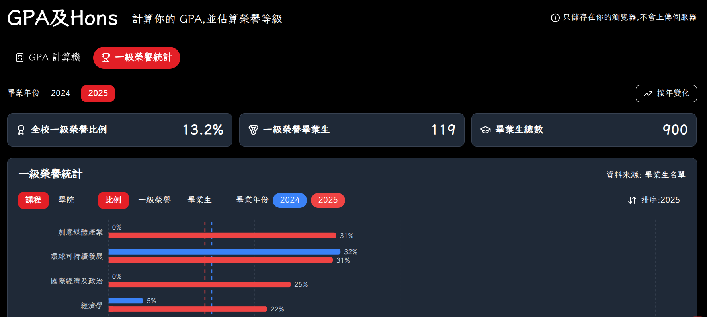
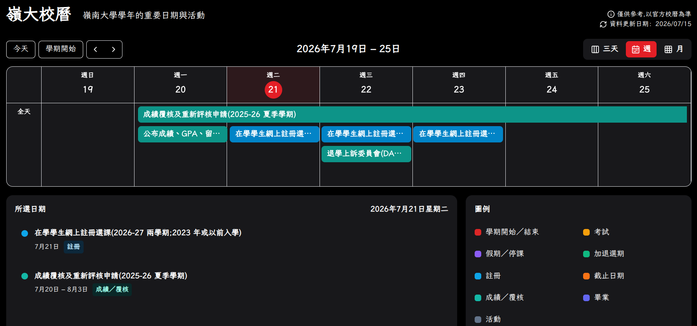

## LingUBible：你的岭南选课好帮手

[**LingUBible**](https://www.lingubible.com/) 是一个由岭南学生亲手打造、专为岭南学生而设的平台，目前已有**超过 200 位同学**使用，助你**更精明地选课**、**更快捷地规划学期**，**减少对成绩的忧虑**。

## 🌟 LingUBible 能为你提供以下功能 🌟

### **浏览及撰写课程／导师评价**
选课前先参考同学的真实评价，避免盲目选课；修读过某课程后，也可分享你的体验，帮助师弟师妹

### **浏览及下载课程大纲与历届试卷**
无需四处查询，课程大纲与历届试卷均可在平台一站式搜索

### **时间表规划**
点选课节并即时预览每周时间表，在选课加退选期开始前，及早发现时间冲突或空堂，并排出休课日

### **GPA 计算器及荣誉统计**
即时计算你的 GPA，并了解自己在荣誉学位分级中的位置，随时掌握学业状况

### **岭南校历**
一览重要学期日期及截止日期，无需再逐页翻查大学网站

### **👉 立即到 [LingUBible](https://www.lingubible.com/) 试用 — 好的决定，从掌握资讯开始！**

- 作者：[Anson Lo](https://ansonlo.dev/)
