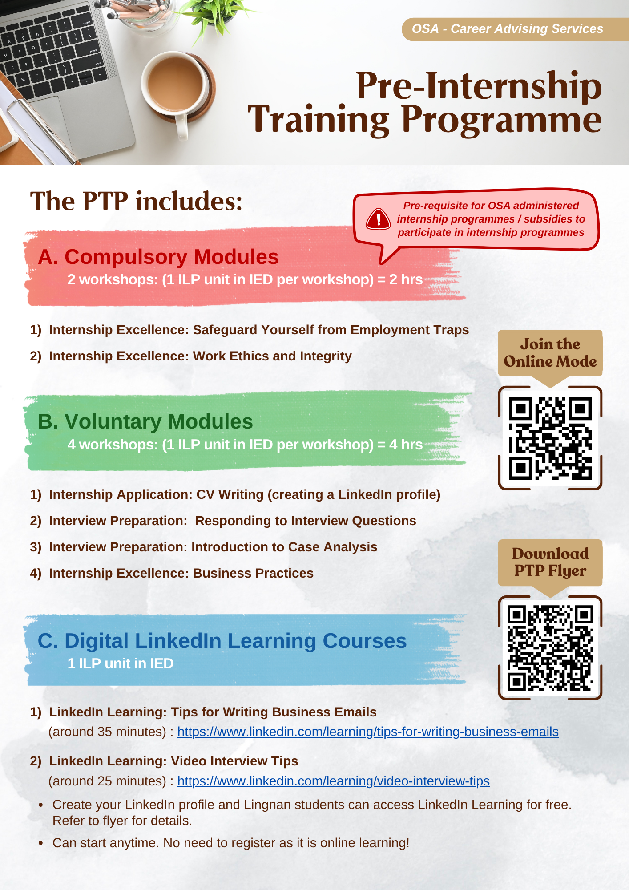
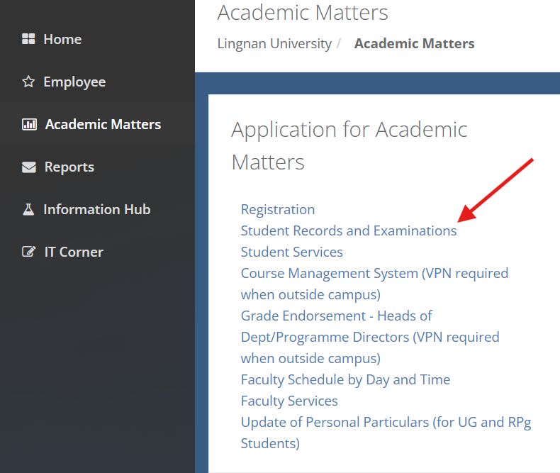
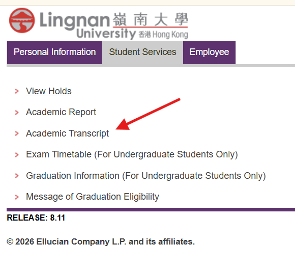
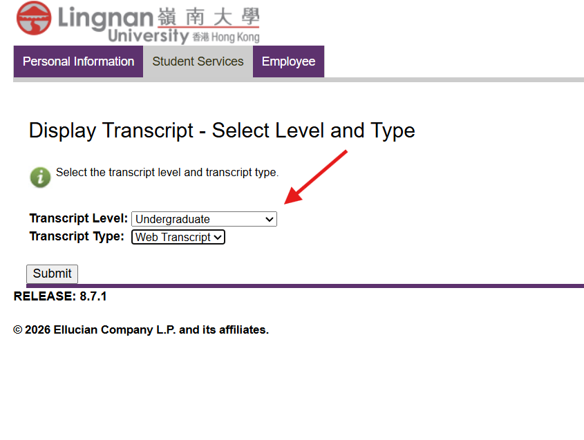

# Local Internship Opportunities at Lingnan University 
Last reviewed: date needed
**Audience：** All 

Since the market is bringing more concerns in practical experience,having an
internship is very important.

No matter what year are you, having an internship should be a must.

photo from: https://encrypted-tbn0.gstatic.com/images?q=tbn:ANd9GcTbeRyxvLzkOT1aUIGUkz1pmqS02GeJhvsAcoiY0zlzBQ&s=10

Today, this wiki page is to introduce the internships available at Lingnan University.

Here are the internships available:
1. STEM Internship Scheme/ ITC stem internship programe
2. Local Summer Internship Programme (LSIP)
3. Government Post-Secondary Student Summer Internship Programme (GOVT)

# ITC STEM Internship Scheme

source: https://encrypted-tbn0.gstatic.com/images?q=tbn:ANd9GcRBZiE5UryTlNuMnJXM43cBGsYSGbOdQgbgGAIijhh65A&s=10

The ITC STEM Internship Scheme is a local summer internship scheme for students in STEM-related programmes. The scheme aims to help students gain innovation and technology-related work experience, such as coding, data analytics, and 3D modelling. 

## Quick checklist

- [ ] Check whether your programme is eligible. 
- [ ] Prepare a resume and basic personal information.
- [ ] Join the briefing session.
- [ ] Submit the application form before the deadline.
- [ ] For non-local students, check whether you have a valid No Objection Letter (NOL). 

## Key details

- **Mode:** Full-time.
- **Location:** Local on-site internship.
- **Internship period:** Usually within 1 June to 31 August. 
- **Duration:** 28 to 59 consecutive days. 
- **Allowance:** HKD 393 per day  (Verify with Lingnan University before acting.)
- **Eligible students:** Students studying STEM-related programmes. 

## Non-local students

- Non-local students should check the latest employment and internship rules before applying. 
- A valid **No Objection Letter (NOL)** is required before starting work in Hong Kong. 
- For study-related internships outside the summer period, prior endorsement and approval from the School or department may be required. 
- Adequate lead time is important because approval and immigration processing may take several weeks. 

## Application process

1. Check the programme details and timeline on the official page. 
2. Join the information session or briefing session if available.
3. Complete the application form.
4. Prepare the required materials, which may include:
   - Basic personal information.
   - Resume.
   - A short response on what you hope to gain from the internship.
   - Preferred job roles.
5. Submit the form before the stated deadline.

## Before the internship

If you are shortlisted, you may need to complete pre-internship preparation required by the University before the internship and the 3 items listed in the programme's website. Verify the latest requirements on the official page before acting. 

## Notes

- Submit early if the programme uses rolling review or limited interview slots. Verify with Lingnan University before acting.
- Contact details, deadlines, allowance amounts, and quota arrangements may change each year. Verify all time-sensitive details on the official page before applying.

## Official source

- Lingnan University internship programmes page: [Office of Student Affairs internship programmes](https://www.ln.edu.hk/osa/career/internships) 
- ITF scheme overview: [STEM Internship Scheme](https://www.itf.gov.hk/en/support-measures/stem-internship-scheme/index.html) 
- Non-local student employment policy: [Policy for Non-local Students (Internship/Part-time Job)](https://www.ln.edu.hk/osa/career/internships/policy-for-non-local-students-internship-part-time-job)

# Pre-Internship Training Programme 

Source:  email subject: [Online Mode Available till 31 August 2026] Pre-Internship Training Programme (PTP) - to fulfil Prerequisite for OSA internship programmes and subsidy application in 2025-26

The PTP training programe aims to prepare students for internship like employment traps identification, CV writing etc. This is required if you need to apply for OSA-administered internship programmes or subsidies. 

**Mode**: face to face / zoom / online self learning

## Programe structure

1. Compulsory Modules (mandatory)
2. Voluntary Modules (Optional)
3. Digitial LinkedIn Learning Courses (Optional)

Each workshop = 1 ILP unit

**Small interlude**: Having a Linkedin profile is necessary for job seeking and networking.

**Details** email subject: [Online Mode Available till 31 August 2026] Pre-Internship Training Programme (PTP) - to fulfil Prerequisite for OSA internship programmes and subsidy application in 2025-26

## LSIP programe

Source: https://encrypted-tbn0.gstatic.com/images?q=tbn:ANd9GcTFaMBzh9RsQOSRLU3Vim-UQLGWIUpeiADaxXQdaqCPbw&s=10

The Local Summer Internship Programme (LSIP) is a programe that aims to provide students with experience in ever-changing workplace culture, skills. That raises their chances of being employed after graduation.

## Quick checklist
- [ ] Join the briefing session
- [ ] Submit the application form before the deadline.
- [ ] Prepare a resume and a photo of yourself in business attire
- [ ] Copy of Online Transcript
    - Please view here: [How to get an academic transcript](#how-to-get-an-academic-transcript)
- [ ] Book an interview from the online application form
- [ ] Finish Post-Internship Self-Evaluation with photo **if you finished the internship**
- [ ] Attend the debriefing **if you finished the internship**

## Key details

- **Mode:** Usually full time (Not Stated in the webstie)
- **Location:** Local 
- **Internship period:** Jun to Aug 
- **Duration:** about 8-12 weeks
- **Allowance:** Depend on the company you are in.
- **Eligible students:** All students.

## Application process

1. Fill out the application form.
2. Upload your CV and your photo in business attire
3. Submit two Essays (One in English and One in Chinese): 
    1. English version about reason you apply and the achievement you want from the job. 
    2. Chinese version about your strengths and weaknesses

## Notes:
- The interview session is first-come-first served
- Additional documents may be required if you have a 2nd interview
- Nominate no more than 3 companies
- Students with the corresponding traits are more likely to be considered:
    - Non-final year full time
    - Motivated
    - Proficient in (English, Putonghua, Cantonese)
    -Effective communication skills

## Official source

- Lingnan University internship programmes page: [Office of Student Affairs internship programmes](https://www.ln.edu.hk/osa/career/internships)
- Lingnan University Local Summer Internship Programme: [LSIP programe](https://www.ln.edu.hk/osa/career/lsip)

# How to get an academic transcript

Step 1:

please go to: https://myportal.ln.edu.hk/web/lingnan/academicmatters

Step 2:

Please click student Transcript

Step 3:

Please select Undergraduate and thenn click submit

Step 4:
When you see the website please click Crtl + P (Windows)/  Command (⌘) + P (Mac)

**Caution:** The online transcript is **A3** size, so please bring an **A3** folder 