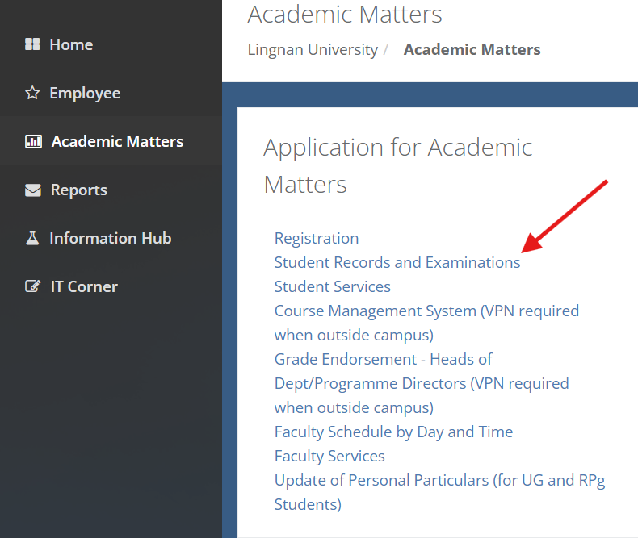
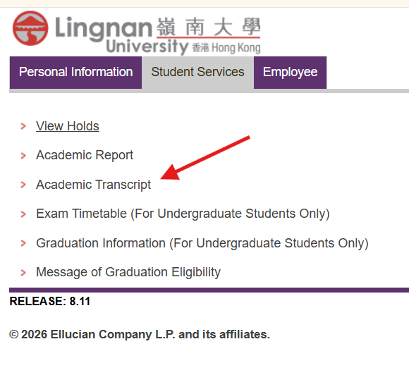
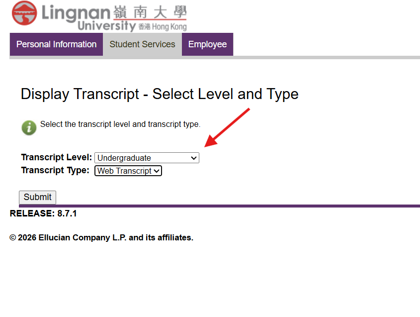
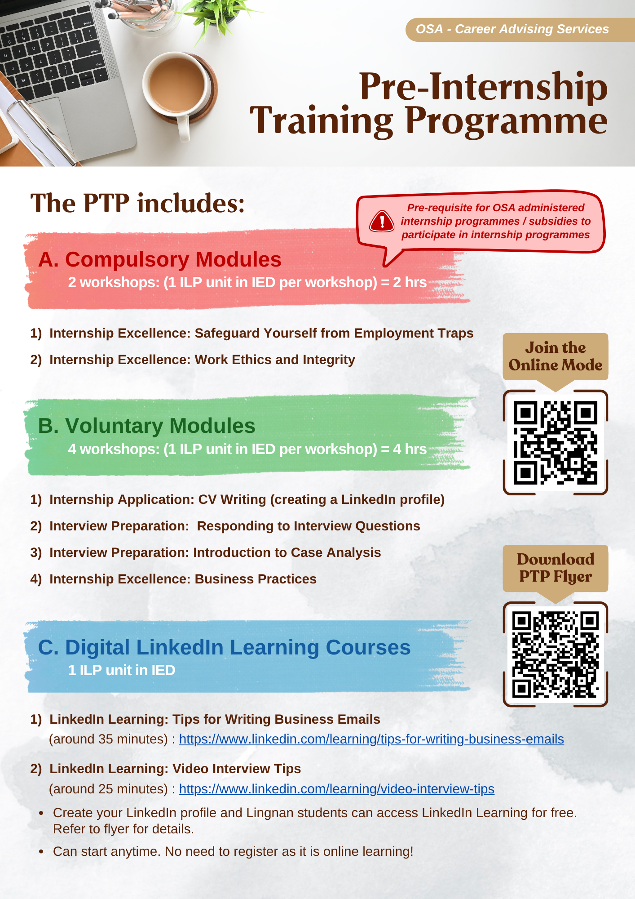

<<<<<<< HEAD
# Local Internship Opportunities at Lingnan University 
Last reviewed: date needed
**Audience：** All 

Since the market is bringing more concerns in practical experience, having an
internship is very important.

No matter what year are you, having an internship should be a must.

photo from: https://encrypted-tbn0.gstatic.com/images?q=tbn:ANd9GcTbeRyxvLzkOT1aUIGUkz1pmqS02GeJhvsAcoiY0zlzBQ&s=10

Today, this wiki page is to introduce the local internships available at Lingnan University.

Here are the internships available:
1. STEM Internship Scheme/ ITC stem internship programe
2. Local Summer Internship Programme (LSIP)
3. Government Post-Secondary Student Summer Internship Programme (GOVT)

## ITC STEM Internship Scheme

The ITC STEM Internship Scheme is a local summer internship scheme for students in STEM-related programmes. The scheme aims to help students gain innovation and technology-related work experience, such as coding, data analytics, and 3D modelling. 

### Quick checklist

- [ ] Check whether your programme is eligible. 
- [ ] Join the briefing session.
- [ ] Prepare a resume and basic personal information.
- [ ] Submit the application form before the deadline.
- [ ] For non-local students, check whether you have a valid No Objection Letter (NOL) please see [Things you should know](#things-you-should-know). 

### Key details

- **Start time:** Usually late April of term 2 (Please verify)
- **Mode:** Full-time.
- **Location:** Local on-site internship.
- **Internship period:** Usually within 1 June to 31 August. 
- **Duration:** 28 to 59 consecutive days. 
- **Allowance:** HKD 393 per day  (Verify with Lingnan University before acting.)
- **Eligible students:** Students studying STEM-related programmes. 

### Application process

1. Join the information session or briefing session if available.
2. Complete the application form.
3. Prepare the required materials, which may include:
   - Basic personal information.
   - Resume.
   - A short response on what you hope to gain from the internship.
   - Preferred job roles.
4. Submit the form before the stated deadline.

### Before the internship

If you are shortlisted. Please finish the PTP-Internship Training Programe ([PTP Internship Training Programe Explained](###pre-internship-training-programme ))and the other 2 items listed in the website 

Advice from the writer: No matter you are shortlisted or not participating the PTP-Internship is still worthy.

### Notes

- Submit early if the programme uses rolling review or limited interview slots. Verify with Lingnan University before acting.
- Contact details, deadlines, allowance amounts, and quota arrangements may change each year. Verify all time-sensitive details on the official page before applying.
-  OSA may provide a minimum amount of subsidy to students whose internship is unpaid, if necessary.

### Official source

- Lingnan University internship programmes page: [Office of Student Affairs internship programmes](https://www.ln.edu.hk/osa/career/internships) 
- ITF scheme overview: [STEM Internship Scheme](https://www.itf.gov.hk/en/support-measures/stem-internship-scheme/index.html) 
- Non-local student employment policy: [Policy for Non-local Students (Internship/Part-time Job)](https://www.ln.edu.hk/osa/career/internships/policy-for-non-local-students-internship-part-time-job)

## The Local Summer Internship Programme (LSIP)

Source: https://encrypted-tbn0.gstatic.com/images?q=tbn:ANd9GcTFaMBzh9RsQOSRLU3Vim-UQLGWIUpeiADaxXQdaqCPbw&s=10

The Local Summer Internship Programme (LSIP) is a programme that aims to provide students with experience in an ever-changing workplace culture and skills. This raises their chances of being employed after graduation. It consists of mainstream and Sports and Health Stream

### Quick checklist
- [ ] Join the briefing session
- [ ] Submit the Online Application Form before the deadline.
- [ ] Prepare a resume and a photo of yourself in business attire
- [ ] Copy of Online Transcript
    - Please view here: [How to get an academic transcript](#how-to-get-an-academic-transcript)
- [ ] Book an interview in the **Online** Application Form 
- [ ] Finish Post-Internship Self-Evaluation with photos **if you finished the internship**
- [ ] Attend the debriefing **if you finished the internship**

### Key details

- **Start time:** Usually Term 2 January (Please verify)
- **Mode:** Usually full time (Not Stated in the websuite)
- **Location:** Local 
- **Internship period:** Jun to Aug 
- **Duration:** about 8-12 weeks
- **Allowance:** Depend on the company you are in. For more details please view [Notes](#notes)
- **Eligible students:** Students who are fluent in **English** and **Chinese**

### Application Process

1. Fill out the **Online** application form. (University VPN required)
   a. Online Application Form (Main Stream) for main stream students
   b. Online Application Form (Sports and Health) for students who are interested in Sports and Health

2. Upload your CV and your photo in business attire

3. Submit two Essays (One in English and One in Chinese, <150 words for both):
   i. English version about reason you apply and the achievement you want from the job.
   ii. Chinese version about your strengths and weaknesses

### Before the internship

If you are shortlisted. Please finish the PTP-Internship [PTP Internship Explanation](###pre-internship-training-programme )

### Notes:
- The interview session is first-come-first served
- Additional documents may be required if you have a 2nd interview
- Nominate no more than 3 companies
- Students with the corresponding traits are more likely to be considered:
    - Non-final year full time
    - Motivated
    - Proficient in (English, Putonghua, Cantonese)
    - Effective communication skills
    - Sports and Health interest students should fill out the Online Application Form (Sports and Health) as they are treated separately

### Official Source

- Lingnan University internship programmes page: [Office of Student Affairs internship programmes](https://www.ln.edu.hk/osa/career/internships)
- Lingnan University Local Summer Internship Programme: [LSIP programe](https://www.ln.edu.hk/osa/career/lsip)

## Government Post-Secondary Student Summer Internship Programme (GOVT)

Source: https://encrypted-tbn0.gstatic.com/images?q=tbn:ANd9GcTCBEBc-PAF2WpMAUWOY5gDbPM-Gdr-ixkfSTDBq7b-XWs--DTE41v2isAv&s=10

The GOVT programe is offered by the HKSAR government aiming to give summer internship opportunites to full time UG students who are permanent resident of Hong Kong .

### Quick Checklist
- [ ] Review the [Job Information Platform (JIP)](https://www.ln.edu.hk/osa/jip) in the outlook email
- [ ] Check regularly in the outlook email whether you are nominated or not

### Key Details

- **Start time:** Not fixed please check [JIP](https://www.ln.edu.hk/osa/jip) regularly
- **Mode:** Usually full time (Not Stated in the website)
- **Location:** Local 
- **Internship period:** Depend on the job you are in
- **Duration:** Not stated
- **Allowance:** Depend on role and department you are in
- **Eligible students:** Full time UG students who are permant residents of Hong Kong

### Application process

1. Navigate to [Job Information Platform (JIP)](https://www.ln.edu.hk/osa/jip)

2. Look for the detail and required documents in JIP

Normally it would include.
1. CV
2. Your photo
3. Academic Transcript

### Notes 

#### Government Internship Nomination Process

The nomination process is handled by OSA Career Advising Services. The exact selection method may vary depending on the number of applicants, available vacancies, and requirements of individual departments.

- Eligibility screening: OSA reviews applicants’ qualifications and application materials.
- Selection & matching: Suitable candidates may be selected based on eligibility, skills, and internship requirements.
- Additional assessment: Some specialised positions may require interviews or skill assessments.
- Final decision: OSA Career Advising Services makes the final nomination arrangement.

Advice: Prepare a strong CV and highlight relevant skills, especially for specialised roles such as data science, IT, or research.

### Official Source
- Lingnan University Government Post-Secondary Student Summer Internship Programme [GOVT](https://www.ln.edu.hk/osa/career/govt)

## Things you should know
### How to get an academic transcript

Step 1:

please go to: https://myportal.ln.edu.hk/web/lingnan/academicmatters

Step 2:

Please click student Transcript

Step 3:

Please select Undergraduate and thenn click submit

Step 4:
When you see the website please click Crtl + P (Windows)/  Command (⌘) + P (Mac)

**Caution:** The online transcript is **A3** size, so please bring an **A3** folder 

### Pre-Internship Training Programme 

Source:  email subject: [Online Mode Available till 31 August 2026] Pre-Internship Training Programme (PTP) - to fulfil Prerequisite for OSA internship programmes and subsidy application in 2025-26

The PTP training programe aims to prepare students for internship like employment traps identification, CV writing etc. This is required if you need to apply for OSA-administered internship programmes or subsidies. 

**Mode**: face to face / zoom / online self learning

#### Programe structure

1. Compulsory Modules (mandatory)
2. Voluntary Modules (Optional)
3. Digitial LinkedIn Learning Courses (Optional)

Each workshop = 1 ILP unit

**Small interlude**: Having a Linkedin profile is necessary for job seeking and networking.

**Details** 
- [PTP programe](https://osa.ln.edu.hk/files/PTP_info_20260401.pdf)
- email subject: [Online Mode Available till 31 August 2026] Pre-Internship Training Programme (PTP) - to fulfil Prerequisite for OSA internship programmes and subsidy application in 2025-26

### Non-local students

- Non-local students should check the latest employment and internship rules before applying. 
- A valid **No Objection Letter (NOL)** is required before starting work in Hong Kong. 
- For study-related internships outside the summer period, prior endorsement and approval from the School or department may be required. 
- Adequate lead time is important because approval and immigration processing may take several weeks. 

#### Ending
Thank you for reading this wiki page I hope you all to get your desired interns.
=======
In today’s competitive job market, practical experience is invaluable. Regardless of your year of study, securing an internship is a crucial step toward building a successful career. This guide provides an overview of key local internship opportunities facilitated by Lingnan University.

## ITC STEM Internship Scheme
Designed specifically for students in STEM-related programmes, this scheme provides hands-on experience in innovation and technology fields such as coding, data analytics, and 3D modelling.

### Key Details
*   **Timeline:** Opens late April to early May.
*   **Mode:** Full-time.
*   **Period:** Typically 1 June – 31 August.
*   **Duration:** 28 to 59 consecutive days.
*   **Allowance:** Approximately HKD 393 per day (Verify current rates with OSA).

### Application Process
1.  **Verify Eligibility:** Check your programme’s [eligibility](Local_internship_eligibility.en.md).
2.  **Preparation:** Prepare your resume, personal details, a statement of purpose, and identify preferred roles.
3.  **Selection:** Browse the job list on the [official website](https://www.ln.edu.hk/osa/career-planning/internship-placements/local-internships/stem-internship-scheme) and select your top 3 preferences.
4.  **Submission:** Apply before the deadline.
5.  **Requirement:** If shortlisted, you **must** complete the [Pre-Internship Training Programme (PTP)](#pre-internship-training-programme-ptp) and meet any additional OSA requirements.
6.  **Non-local Students:** Meeting working [requirements](#non-local-students).

## Local Summer Internship Programme (LSIP)
The LSIP focuses on developing workplace adaptability and professional skills to improve post-graduation employability. It offers two streams: "Mainstream" and "Sports and Health."

### Key Details
*   **Timeline:** Applications typically open in late January to early February.
*   **Period:** June to August.
*   **Duration:** Approx. 8–12 weeks.
*   **Allowance:** Varies by company.
*   **Selection Criteria:** Candidates who are non-final year, highly motivated, and proficient in English, Putonghua, and Cantonese are preferred.

### Application Process
1.  **Preparation:** Prepare a professional resume and a photo in business attire.
2.  **Writing Requirements:**
    *   **English:** 150-word essay on your motivations and goals.
    *   **Chinese:** 150-word essay on your strengths and weaknesses.
3.  **Documentation:** Obtain your unofficial transcript (refer to this [guide](Local_internship_unofficial_transcript.en.md)).
4.  **Submission:** Submit the application via the online portal (University VPN required).
5.  **Interview:** Book your interview slot directly through the application form.
6.  **Post-Selection:** Shortlisted candidates must complete the [PTP](#pre-internship-training-programme-ptp). Selected students must complete a self-evaluation and attend a debriefing session.

## Government Post-Secondary Student Summer Internship Programme (GOVT)
Offered by the HKSAR Government, this programme provides summer opportunities for full-time undergraduate students who are permanent residents of Hong Kong.

### Key Details
*   **Timeline:** Irregularly throughout the year.
*   **Duration and Allowance:** Dependent on the specific department and role.
*   **Eligibility:** Full-time undergraduate students who are Hong Kong permanent residents.

### Application & Nomination
1.  **Monitor:** Regularly check the **[Job Information Platform (JIP)](https://jobs.ln.edu.hk/login)** using your student email.
2.  **Nomination:** The OSA Career Advising Services manages the nomination process. Selection is based on eligibility, skill matching, and specific departmental requirements.
3.  **Strategy:** Prepare a tailored CV, especially for specialized roles (e.g., data science or IT).

---

## Important Resources & Policies

### Pre-Internship Training Programme (PTP)

The PTP is **mandatory** for all OSA-administered internship and subsidy schemes. It covers vital topics like identifying employment traps and professional CV writing.

*   **Structure:** Includes compulsory/optional modules and LinkedIn Learning courses.
*   **Recognition:** Each workshop earns 1 ILP unit.
*   **Access:** Available via the [online platform](https://osa.ln.edu.hk/ptp). (University VPN required)

### Non-Local Students
To participate in local internships, non-local students must:

*   **NOL:** Obtain a **No Objection Letter (NOL)** from the Hong Kong Immigration Department alongside your student visa.
*   **Approvals:** Internships outside of the summer period require formal approval from your Department or School.
*   **Lead Time:** Processing can take several weeks; plan well in advance.

### Tips for Success Application

*   **Apply Early:** Programmes often utilize rolling admissions; applying as soon as the portal opens increases your chances.
*   **Professionalism:** Treat every internship application with the same rigor as a permanent job application.
*   **Financial Support:** If you secure an unpaid internship, contact the OSA to inquire about available subsidies.

### Official Links
*   [Lingnan University Office of Student Affairs (OSA) - Internship Page](https://www.ln.edu.hk/osa/career/internships)
*   [ITC STEM Internship Scheme Overview](https://www.ln.edu.hk/osa/career-planning/internship-placements/local-internships/stem-internship-scheme)
*   [LSIP Programme Information](https://www.ln.edu.hk/osa/career/lsip)
*   [Government Internship (GOVT) Information](https://www.ln.edu.hk/osa/career/govt)
*   [Non-local student employment policy: Policy for Non-local Students (Internship/Part-time Job)](https://www.ln.edu.hk/osa/career/internships/policy-for-non-local-students-internship-part-time-job)

-----

Last Reviewed: 28 July 2026  
Author: Wilson
>>>>>>> origin/main
