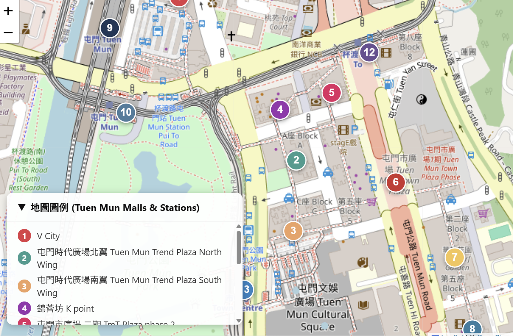

## Places to eat around Lingnan 

If you have tried the restaurants inside Lingnan University, you might think that it is disgusting while the price is comparable to others.

Fortunately, there are lots of restaurants in the Tuen Mun district.

In this Wiki, I will tell you the food choices near Lingnan to Farer.

### 1. Fu Tai Shopping Mall

Photo outside Fu Tai Mall

#### Choices 

1. Fairwood (大快活) (Address: Shop 216, 2/F, Fu Tai Shopping Centre, 9 Tuen Kwai Road, Tuen Mun) 

Author's comment: 
    taste: good
    price: 9/10
    Healthy: 8/10
    Variety :5/10
    Speed : 7/10

The healthiest choice as it offers more healthy dishes then other restaurants. We also have student discount in here. 

2. ITAMOMO (意樂) (Address: Shop 217, 2/F, Fu Tai Shopping Centre, 9 Tuen Kwai Road, Tuen Mun)

Author's comment: 
    taste: good
    price: 6/10
    Healthy: 6/10
    Variety :7/10
    Speed:5/10

The closest western style restaurant near Lingnan University. The taste are ok. However, sometimes dishes comes very late.

3. LimeFish (漁樂) (Address: Shop 103E, 1/F, Fu Tai Shopping Centre, 9 Tuen Kwai Road, Tuen Mun)

Author's comment: 
    taste: Fair
    price: 5/10
    Healthy: 5/10
    Variety :7/10
    Speed: 6/10

A bit expensive as their drinks are quite expensive and Hainanese Chicken is not so delicious.

3. Green River Restaurant (翠河) (Address: Shop 213, 2/F, Fu Tai Shopping Centre, 9 Tuen Kwai Road, Tuen Mun)

Author's comment:  
    Taste: Good
    price: 7/10
    Healthy: 6/10
    Variety :7/10
    Speed: 6/10

Author's comment: Here you can eat foods that closer to
Hong Kong-style. The taste is fine

4. McDonald's (Address: Shop 215, 2/F, Fu Tai Shopping Centre, 9 Tuen Kwai Road, Tuen Mun) 

5. KFC (Address: Shop 103D, 1/F, Fu Tai Shopping Centre, 9 Tuen Kwai Road, Tuen Mun)
etc

6. Timbo Shredded Chicken Fu Tai Market (添寶手撕雞) (Address Shop 23A, G/F, Fu Tai Market, Fu Tai Shopping Centre, 9 Tuen Kwai Road, Tuen Mun)

Author's comment:  
    Taste: Fair-Good
    price: 9/10
    Healthy: 7/10
    Variety :6/10
    Speed: 6/10

This is one of the cheapest choice around Lingnan University that their Sesame pasted noodles / rice with shredded chicken and many kind of things to add on. We also have student discount on this restaurant. The major downfall is you must eat out. However, it closes very early at 19:30

7. Tai Zi Noodles (太子粉麵) (Address: Shop 10-12, G/F Fu Tai Market)

There is also a choose 2 dishes + rice but I had forgotten what is the name of it

There are more choices there

### 2. Places around Tseng Choi Street/ Hong Kiu/ Tsing Min Path

Photo of Tseng Choi Street

#### Choices

1. Wan Chuen Siu (Hong Kiu) （雲川燒 虹橋分店） Address: Shop F, G/F, Florence Mansion, 6 Tsing Ling Path, Tuen Mun

Author's comment:  
    Taste: Fair
    price: 6/10
    Healthy: 5/10
    Variety :6/10
    Speed: 7/10

It is difficult to full your stomach in this restaurant as most are Rice noodles and Sweet potato starch. I think the pricing is quite expensive as the dishes are not skillful to be prepared.

2. 道 Michi    Address: Shop B, G/F, Wah Hing Mansion, 7 Tsing Ling Path, Tuen Mun, Hong Kong

3. LUMOS  Address: Shop 13-14, G/F, Lakeshore Building, 7 Tseng Choi Street, Tuen Mun

4.  聚Chill Meet and Chill Address: Shop 14, G/F, Kam Ming Mansion, 15 Tseng Choi Street, Tuen Mun

Author's comment:  
    Taste: Good
    price: 4/10
    Healthy: 5/10
    Variety :6/10
    Speed: 7/10

It is difficult to full your stomach in this restaurant as the noodles are quite small though they are quite tasty to eat and there are no combo so drinks become very expensive. One thing to note that this restaurant seat is a bit small

5.   Candian Pizza  Address: Shop A, G/F, Wah Hing Mansion, 7 Tsing Ling Path, Tuen Mun

6.  賞心悅目 So Pho So Good : Shops B2 & B3, G/F, Ka Hay Building, 19 Tseng Choi Street, Tuen Mun, Hong Kong

Author's comment:  
    Taste: Good-Great
    price: 6/10
    Healthy: 6/10
    Variety :7/10
    Speed: 7/10

The taste of the food are quite great, I really like their Lemongrass Pork Chop and their  rice noodle soup. However, their Lemongrass chicken chop's size is abit smaller than Port ones and their drinks are quite expensive. Moreover, young coconut is not very big.

7.  海陸香餐廳 Surf Ano Turf  Address: Shop 2, G/F, Kam Bong Building, 7 Tsing Chui Path, Tuen Mun, Hong Kong

    Taste: Good
    price: 8/10
    Healthy: 6/10
    Variety : 7/10
    Speed: 7/10

This another choice of eating normal hk dishes. The pricing and the dishes are good. 

This area is  also home to many small eateries and takeaway shops as well.
You'll find plenty of small restaurants and takeaway spots around here.

**Small interlude** 

Image of T-Plus

The commercial podium and car park of T-Plus, a residential development at Rainbow Bridge (Hung Kiu) in Tuen Mun, will be named "Lingnan T-Plus" and is expected to open from the 2026/27 academic year which some course will be held in here

#### Travel Choices from Lingnan University
- **MTR buses:** K51/K51A (Lingnan University Station / Fu Tai Station near SEK)
- **KMB buses:** 53 /261 /67M / 67X/ 67A(Fu Tai Station near SEK)
- **Mini Bus:** 46/ 46X

### ACME Shopping Arcade (GoGO Mall) and  Paris London New York Cinema Shopping center

1. Yi Xiao Long (Tuen Mun)
(壹小籠) address: Shop G39, G/F, Eldo Court Shopping Centre, 112-140 Tuen Mun Heung Sze Wui Road, Tuen Mun

Author's comment:
    Taste: Good
    price: 7/10
    Healthy: 6/10
    Variety : 8/10
    Speed: 7/10

The dim sum here are not very hot enough but their variety is ok. One thing to note that their pork buns‘ filling is not very enough

This area is  also home to many small eateries and takeaway shops as well.
You'll find plenty of small restaurants and takeaway spots around here.

2. Aomori Ryouri 青森料理 Address:  G4, Ground Floor, Go Go Mall, 112–140 Tuen Mun Heung Sze Wui Road, Tuen Mun.
Taste: Good
    price: 8/10
    Healthy: 6/10
    Variety : 8/10
    Speed: 7/10

The Chicken Cutlet Rice with Silky Egg (D3) is quite delicious for the Chicken Cutlet and eggs and some Enoki mushroom. However, when you eat from top to down you might find that it is less delicious for the rice. Other things like the sauce of dumplings and California roll are yummy.

3. 哈比斯燒肉串和咖哩 Habib's Address: S58, 1st Floor, Go Go Mall, 112–140 Tuen Mun Heung Sze Wui Road, Tuen Mun.

4. 芝士烘 Crazy Cheesecake Address: S72, 1st Floor, Go Go Mall, 112–140 Tuen Mun Heung Sze Wui Road, Tuen Mun.

5. 小川滬拉麵小籠 Address: Shop S76, 1/F, Go Go Mall, 112-140 Tuen Mun Heung Sze Wui Road, Tuen Mun

Horrible mentions:

1. 上海美美豆漿  Address: Shop 4, G/F, Hong Lai Garden, 129 Tuen Mun Heung Sze Wui Road, Tuen Mun

Author's comment:
    Taste: Poor
    price: 5/10
    Healthy: 3/10
    Variety : 5/10
    Speed: 8/10

Although many people said this restaurant is very great to eat but it is really awful
    1. The environment is unclean
    2. The seats are not comfortable
    3. Meat are fried and not fresh
    4. The meat after fried does not taste good

#### Travel Choices 
- **MTR BUS:** K51/ K51A
- **KMB BUS:** 53/ 67M/ 67X/ 261/ 46/ 46X
- **LWB BUS:** A33X (very expensive as it is bus to airport)

### Tuen Mun Town Center

The Tuen Mun Town Center consist of multiple shopping malls. For newcomers, you will be get lost 
so here is a map

- **Tuen Mun Town Plaza(屯門市廣場) / tmtplaza**

-  **Tuen Mun Trend Plaza(屯門時代廣場)**

- **K-Point (錦薈坊)**

- **WALDORF SHOPPING CENTRE (華都商場)**

- **New Town Commericial Arcade 新都**

- **V City**

4. Hands Plaza (Light rail On Ting Station, A33X (expensive)
5. Places Around Man Bo Building

There are more choice!

## More details in 
For more details of buses route please go to 
- HKemobility
- [KMB website](https://search.kmb.hk/KMBWebSite/?action=routesearch&route=1)
Money Saving tip: At LYH there is a KMB University Fare Saver Station 

By: Wilson